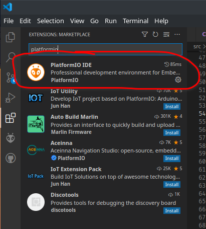

# Getting started

To start with, install the CP2102 drivers if you are using Windows [here](https://www.silabs.com/documents/public/software/CP210x_Universal_Windows_Driver.zip). If you are using Linux, add yourself to the `uucp` or `dialout` group. The group depends on which distro you are using.

Plug in your TCU and make not of the COM/TTY Port that appears in device manager (Windows), or DMESG (Linux)

## I've just built my own TCU
If you've just assembled your own TCU, you will need to do a few steps in order to upload the first initial firmware onto your TCU!

Once you have uploaded the firmware, you can then continue from [I've received an assembled TCU](#ive-received-an-assembled-tcu)


### Development platform

To begin, install [VSCode](https://code.visualstudio.com/download), **NOT FULL FAT VISUAL STUDIO!**.

Then, navigate to extensions, and install the 'platformIO IDE' extension for vscode.


Next, clone (Or download) the Ultimate-NAG52 TCU firmware repository from Github via [this link](http://github.com/rnd-ash/ultimate-nag52-fw), and open the folder within VSCode. PlatformIO now should automatically startup and begin indexing the folder and installing all necessary ESP32 platform software.

Next, open `platformio.ini`, and change the values of `monitor_port` and `upload_port` to whatever your TCU's COM port is.

**EXAMPLE: WINDOWS**

```ini
upload_port = COM4
monitor_port = COM4
```
**EXAMPLE: LINUX**

```ini
upload_port = /dev/ttyUSB0
monitor_port = /dev/ttyUSB0
```

Next, press the key combination `CTRL+ALT+U`, and platformio should begin building and uploading the initial firmware to the TCU!

**Important**. Upon uploading complete, you will hear the TCU beeping 5 beeps in a loop. This is normal. DO NOT plug the TCU into your vehicle yet! The TCU is currently in failsafe mode due to the TCU not knowing what board revision it currently is.

In order to rectify this, you will need to run the configuration app, and set the board variant in TCU config. This can be done by watching [this video](https://youtu.be/ov3pYcKIA70?t=202)

## I've received an assembled TCU