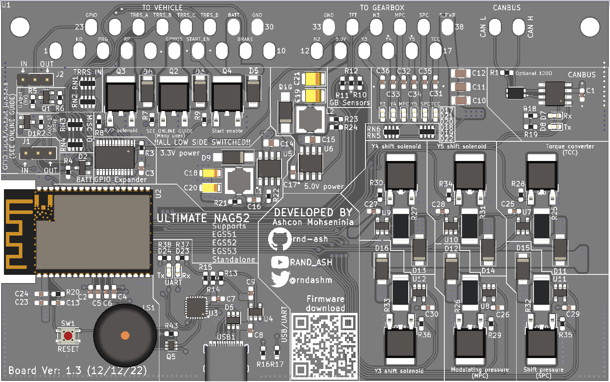
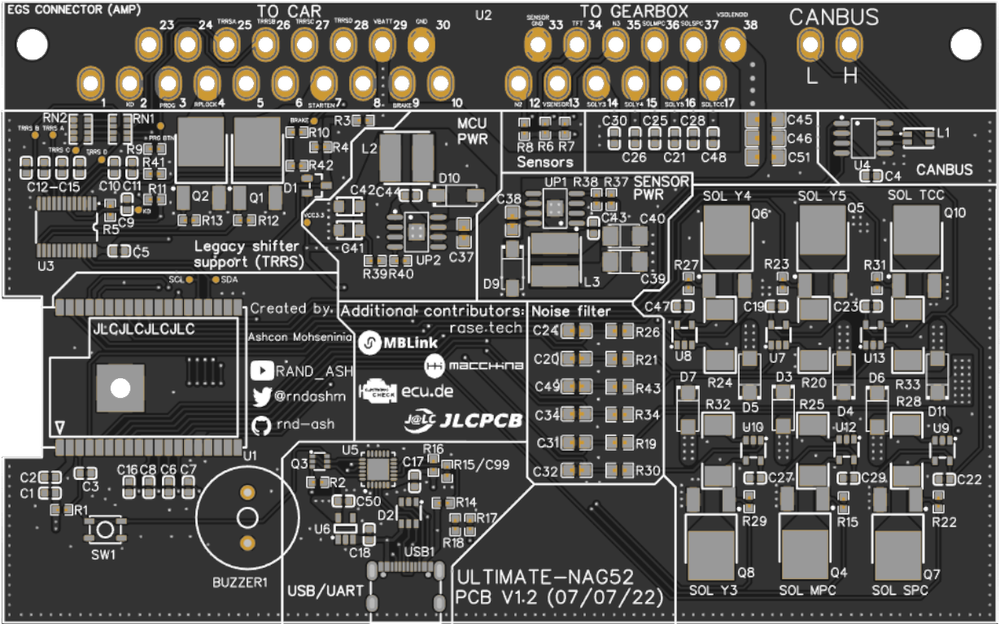
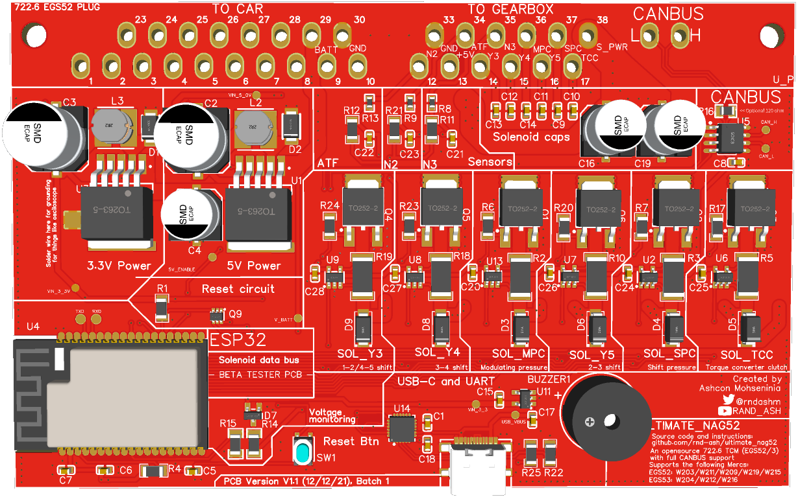

# PCB Revision history

This section outlies the various PCB versions that have been in development during this project, as well as what features the boards add.

## V1.3 (12/12/22)

* Switched all basic SMD components (Capacitors and resistors), for higher temperature rated ones, in order to better handle engine bay installations
* Added LEDs for CAN, UART and Solenoids
* Added general purpose N-channel MOSFET on pin 6
* Added multi-use IO for pin 23 (Allows for reading G-class' output shaft sensor, or driving a speed sensor in some W124 applications)
* Added QR code on PCB silkscreen for firmware download link

## V1.2 (07/07/22)

* Added legacy shifter support. This adds support for W210 generation of vehicles, and some early cars built from 2000. This includes a GPIO expander which reads data from the TRRS data lines, the Kickdown, Brake and Program button inputs, and outputs for start enable.
* Switch CP2104 for CP2102 UART bridge
* Add ESD Diode to PCB
* Switched buck converters to more modern circuity
* Removed all electrolytic capacitors in favour of Tantalum ones

## V1.1 (12/12/21)

* Initial PCB made publicly available for testing