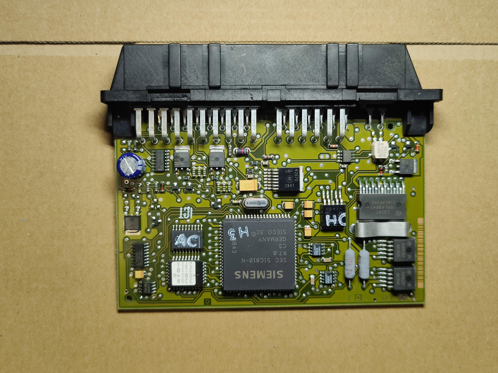
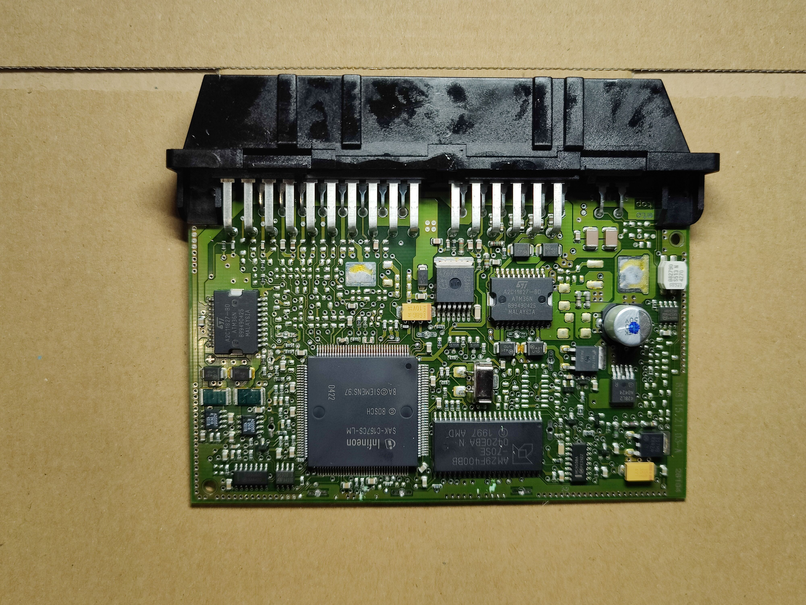
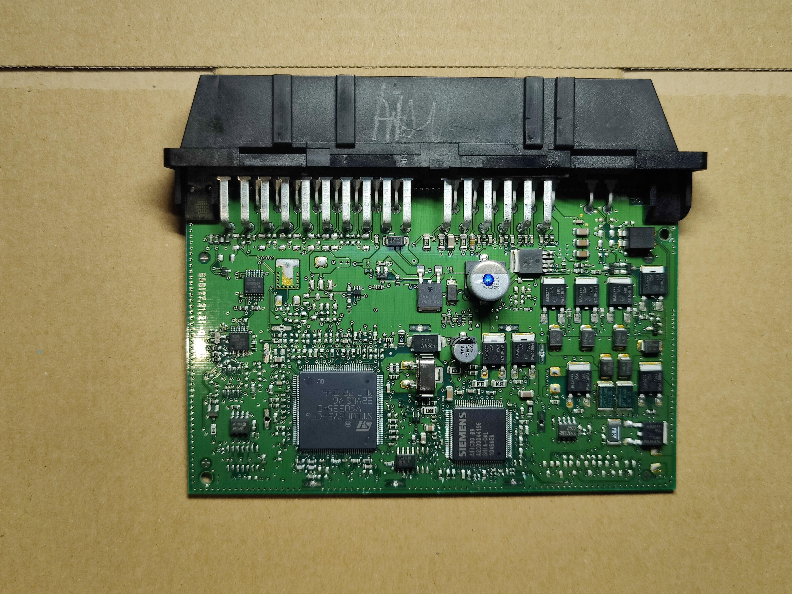

# Ultimate NAG52
An open implementation of NAG52 (722.6 Transmission controller), complete with KWP2000 diagnostics and CANBUS support, with support for all cars that came with the EGS51, EGS52 or EGS53 TCU.

## IMPORTANT Disclaimer

By running this board in your car, you accept that there will be 0 liability for anything that goes wrong. Whilst official firmware releases will be tested thoroughly on simulations first to ensure that they are safe for daily and long term driving, if you modify the firmware yourself and kill your car or engine, DO NOT blame the board, or me!

Boards sold through me will come with a warranty in case of any hardware failure specific to the board itself. If you choose to assemble a board yourself, or fabricate your own using the schematics and Gerber however, those will NOT come with any warranty. **YOU ARE ON YOUR OWN**.

## PCB Schematics

Check the [PCB](PCB/) folder for schematics, and **NOW GERBER FILES**

## Video playlist

See the following [youtube playlist](https://youtube.com/playlist?list=PLxrw-4Vt7xtu9d8lCkMCG0_K7oHcsSMtF)
An alternative series can be found on Odysee (Ad free) [here](https://odysee.com/@rand_ash:58/ultimagenag52:f)

## Additional resources

* [TCU firmware repository](https://github.com/rnd-ash/ultimate-nag52-fw)

## Who is this project for?

**For now, I am only officially supporting Daimler made vehicles.** Vehicles that come with the 722.6 transmission (Mercedes 5-speed automatic gearbox) are supported. This project aims to create a drop-in replacement TCM that works with all 3 TCM iterations that Mercedes had for this gearbox:

### EGS51 

EGS51 is found in most Mercedes vehicles with the 722.6 made before 2000. It has the legacy shifter module (Where the gear selector is wired to the TCM directly)

### EGS52

EGS52 is found in most Mercedes vehicles with the 722.6 made between 2000 and 2008. It supports both the legacy shifter module (Mentioned above) and the newer CAN style gear shifter (Where the gear selector is another ECU on CANBUS and communicates over CANBUS with the TCM)

### EGS53 

EGS53 is found in any Mercedes vehicles with the 722.6 made after 2008. It is the latest design iteration of the TCM, and only supports the CANBUS shifter module.

### How come other custom TCMs do not support all 3 TCMs?

Short answer. Who knows. This project was made from the ground up to be modular such that the same controller could be used as a drop-in for all 3 TCMs. With my extensive CAN documentation on these Mercedes vehicles though, I have been able to reverse engineer the entire CAN-C network which allows for my controller to work perfectly in all cars which require CAN communication with the TCM in order to avoid going into limp mode. This has the additional benefits that other custom TCMs seemingly don't support:

* Torque requesting
* Monitoring of ESP events and acting accordingly
* Full diagnostic compatibility with the OEM EGS52 and EGS53 TCUs (CAN only). This means that my TCM works with DAS/Vediamo diagnostic tools, and identifies itself as the OEM TCM!

### What issues does this project aim to fix compared to the stock TCMs?

Simply put, as the controller for this TCM (The ESP32) is much faster when compared to all the OEM TCMs, and has a lot more RAM, it has allowed for a much more complex shift adaptation system to be coded for it, allowing for a lot more parameters of each gearshift to be modified, which in the long term fixes issues like rough shifting or flaring when changing gears which the original TCMs will not be able to adapt to unless someone manually edits the shift pressure maps.
