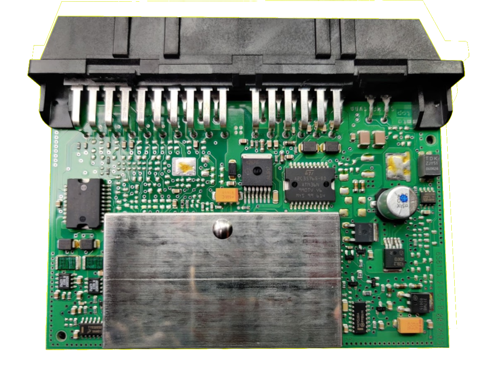

# Ultimate NAG52
An open implementation of NAG52 (722.6 Transmission controller), complete with KWP2000 diagnostics and CANBUS support

## PCB Schematics
Check the [PCB](PCB/) folder for schematics, and **NOW GERBER FILES!**

## Video playlist

See the following [youtube playlist](https://youtube.com/playlist?list=PLxrw-4Vt7xtu9d8lCkMCG0_K7oHcsSMtF)
An alternative series can be found on Odysee (Ad free) [here](https://odysee.com/@rand_ash:58/ultimagenag52:f)

NOTE: This repo is a placeholder for holding schematics and misc data about the project. For the firmware itself,
see the repository list below!

## Repository list

* [FIRMWARE for ESP32 PCB](https://github.com/rnd-ash/ultimate-nag52-fw)

## Who is this project for?

| TCM status | Development status |
|----|----|
|EGS52| Early WIP (Check firmware) |
|EGS53| Not started yet |

The 722.6 (NAG1/2) gearbox is used in many vehicles, main Mercedes, however other car manufacturers use it!

The controller comes in 2 flavours (EGS52, the older model used between 2000-2007), and EGS53, used in 2008 and newer vehicles.

Below are a list of vehicles that support the 722.6 gearbox, either with the EGS52 or EGS53 TCM. **NOTE** that some vehicles offer different gearboxes on different engines, so please check your own car to see if it has a 722.6 transmission!

### EGS52 TCM
* Mercedes
    * W203 (2000-2006 C class)
    * W211 (2002-2006 E class)
    * W215 (2000-2006 CL class)
    * W220 (1999-2005 S class)
    * W209 (2003-2005 CLK class)
    * W163 (1998-2005 ML class)
    * W463 (1996-2006 G class)
    * R170 (1997-2003 SLK)
    * R230 (2001-2006 SL)
* Maybach
    * 57 (2002-2006 Mayback 57)
    * 62 (2002-2006 Mayback 62)
* Dodge
    * Magnum (2005-2008)
    * Charger (2006-2008)
    * Sprinter (2003-2006)
* Chrysler
    * Crossfire (2004-2008)
    * 300 (2005-2008)
* Jaguar
    * X308 (1998-2003)
    * XK (1998-2002 X100)
* Porsche
    * 911 (1997-2006)

### EGS53 TCM
* Mercedes
    * W221 (2006-2013 S class)
    * C216 (2007-2014 CL class)
    * W212 (2009-2011 E class)
    * W204 (2007-2011 C class)
    * W209 (2006-2009 CLK class)
    * W463 (2007-2012 G class)
    * R171 (2007-2010 SLK class)
    * R230 (2007-2011 SL class)
    * W199 (2005-2009 SLR class)
* Maybach
    * 57 (2007-2013 Mayback 57)
    * 62 (2007-2013 Mayback 62)
* Dodge
    * Nitro (2007-2011)
    * Challenger (2009-2014)
    * Durango (2011-2012)
* Chrysler
    * 300 (2008-2014)
* Ssangyong
    * Kyron (2006-Today)
    * Actyon sport (2014-Today)

Below are images showing the differences between EGS52 and EGS53 PCBs:

EGS52:

## How to begin?

Currently there are 2 main routes for starting with ultimate-nag52. Firstly, you can order a working PCB! - This PCB will come with no firmware pre-installed, but will be fully working. Just requires flashing to get started. This board would have been fully tested so its guaranteed to work electrically.

The second option is to use the schematics (TO BE ADDED) to order your own PCB and solder all the components. This is only recommended for users who are very good with soldering! If you choose this path and your PCB blows up your car, I am **NOT** responsible for **YOUR** soldering mistakes!

### Option 1 - Ordering PCB
TBA

### Option 2 - Making PCB
TBA

### Uploading firmware
TBA
