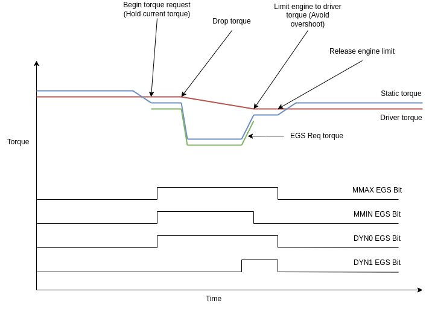

# Signal IO

The TCU needs to set various inputs and outputs, either located physically on the board, or over CAN. Here is a full list!


## EGS CAN
The EGS CAN is an abstraction layer that encompasses both the EGS51,52 and 53 CAN layers. Each CAN layer has its own implementation of the following functions. But here is a list of all functions that currently are implemented on each EGS layer. The CAN abstract layer is located at `canbus/can_hal.h`.


### Getter - Wheel speed(s)

Wheel data is necessary for calculating the output shaft speed of the gearbox, as the 722.6 is known for having no output shaft sensor! The TCU uses the wheel RPM along with the coded differential ratio to calculate the RPM of the output shaft.

```c++
virtual WheelData get_front_right_wheel(uint64_t now, uint64_t expire_time_ms);
virtual WheelData get_front_left_wheel(uint64_t now, uint64_t expire_time_ms);
virtual WheelData get_rear_right_wheel(uint64_t now, uint64_t expire_time_ms);
virtual WheelData get_rear_left_wheel(uint64_t now, uint64_t expire_time_ms);
```

the TCU queries the CAN data received from the ABS or ESP ECU (Depending on ECU in the car that sends it) for the 4 wheel rotations. Each return of the data consists of the following struct:
```c++
struct WheelData {
    int double_rpm;
    WheelDirection current_dir;
};
```

`double_rpm` is the double RPM of the wheel. This allows for the TCU to see the wheel RPM in 0.5 RPM resolutions. `current_dir` tells the TCU which direction the wheel is spinning in. Either forwards, backwards, passive (Not moving), or SNA (Signal not available - This is an error from the Sender ECU)

#### Implementation matrix

|EGS51|EGS52|EGS53|
|:-:|:-:|:-:|
|x|x|x|


### Getter - Torques

In order to create smooth gear shifts, the TCU needs to know the current torque output, and bounds of the engine. This is broadcast over CANBUS. The following functions retrieve it.

```c++
virtual int get_static_engine_torque(uint64_t now, uint64_t expire_time_ms);
virtual int get_driver_engine_torque(uint64_t now, uint64_t expire_time_ms);
virtual int get_maximum_engine_torque(uint64_t now, uint64_t expire_time_ms);
virtual int get_minimum_engine_torque(uint64_t now, uint64_t expire_time_ms);
```

These functions return torque outputs in Nm. If the signal is not found (Expired CAN frame or missing data), the `0xFFFF` is returned by these functions.

* Static torque - The current torque output of the engine. On Petrol engines (with ME ECUs), this is calculated by the engine ECU based on air flow and injection quantity. On CDI engines (With CRD ECUs) this is purely calculated based on injection quantity.
* Maximum torque - The maximum possible torque the engine can output at the current rotation speed.
* Minimum torque - The minimum possible torque the engine can output at the current rotation speed.
* Driver torque - The current torque the engine should output based on pedal position from the driver. This value will jump where static torque will slowly increase as the engine has to catch up.

#### Implementation matrix

|Torque value|EGS51|EGS52|EGS53|
|:-:|:-:|:-:|:-:|
|Static torque|x|x|x|
|Min torque|x|x|x|
|Max torque|x|x|x|
|Driver demand torque|N/A|x|x|

### Getter - Accelerator position

```c++
virtual uint8_t get_pedal_value(uint64_t now, uint64_t expire_time_ms);
```

This function simply returns the current accelerator position as reported by the engine ECU in a range of 0-250. `0xFF` indicates an error in the signal retrieval.

#### Implementation matrix

|EGS51|EGS52|EGS53|
|:-:|:-:|:-:|
|x|x|x|

### Setter - Torque requests

In order to obtain smooth gear shifts, the gearbox will send a signal to the engine to ask it to limit or set a specific output power. This value is set based on computation the TCU does, and changes during the various phases of the gear shifts.

```c++
virtual void set_torque_request(TorqueRequest request);
virtual void set_requested_torque(uint16_t torque_nm);
```

the `request` specifies what kind of torque request is wanted by the TCU. But it typically has the following sequence:

1. None - No torque request is needed
2. Begin - Signal to the engine the torque request shall begin. The engine will now limit its output power to whatever it is currently making, expecting the TCU to signal what torque it needs to make
3. FollowMe - The TCU now sets the requested torque to whatever it wants every 20ms. This creates a torque ramp that the engine will follow. Note that the ramp of the torque curve has to be calculated per engine! ME ECUs do not like sudden torque requests, as the engine has to catch up, the ME ECU seems to try to either limit fuel, retard ignition, or restrict air flow to achieve a target torque request. Compare this to diesel engines, where limiting torque is as simple as cutting fuel.
4. Restore - The TCU tells the engine the torque request is done, the TCU must do this first for 100ms in order to stop the engine from shooting its torque output, which creates a jolt that is noticeable to the driver. In this zone, the engine ECU will get ready to start making power again, the EGS ECU sets the request torque value to a sensible value for release.

#### EGS52 implementation image
This image shows how the EGS module sets the CAN data during each phase of the torque request:


#### Implementation matrix

|Req type|EGS51|EGS52|EGS53|
|:-:|:-:|:-:|:-:|
|None|x|x|x|
|Begin||x||
|Follow me||x||
|Restore||x||